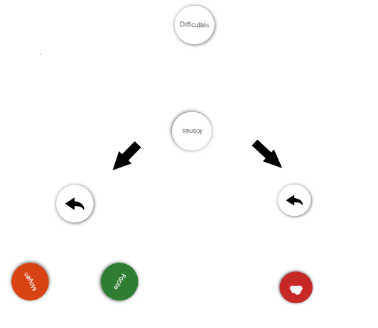
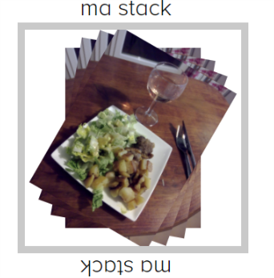

# Widgets
TUIOManager regroupe des widgets utilisables sur une table tactile SAMSUNG SUR40.
Cette documentation présente les différents widgets utilisables et comment les instancier.

Il faut faire attention à ce que l'application Web soit en plein écran pour que la librairie TUIO fonctionne correctement.

Pour toutes les widgets, pour les ajouter à l'application HTML, il faut utiliser la méthode `addTo(domElem)`. Cette méthode prend en argument l'élément DOM HTML, récuperable en javascript avec `getElementById()` ou en JQuery avec `$('#id').get(0)`.

## ElementWidget

ElementWidget est une widget abstraite fournissant un ensemble d'interactions tactiles et tangibles. Cette widget est de forme rectangulaire, et la nature de son contenu (image, vidéo, texte, ...) doit être définit dans une classe héritant d'ElementWidget. Le type de contenu compatible ne se limite uniquement à sa possibilité d'implementation en HTML.


| Nombre de doigts         | Effet           |
| ------------- |:-------------:|
| 1 doigt      | Mouvement de la widget  |
| 2 doigts      | Rotation + Resize    |


Concernant les interactions tangibles, ce sont les mêmes que celles disponibles en tactiles. L'association du tag et de l'interaction se fait via le constructeur de la widget.

#### Fonctions disponibles
```typescript
// Interactions
canRotate(canRotateTangible, canRotateTactile);
canMove(canMoveTangible, canMoveTactile);
canZoom(canZoomTangible, canZoomTactile);
canDelete(canDeleteTangible, canDeleteTactile);
disable(isDisabled);
```
Tous les paramètres de ces fonctions sont des booléens.
Elles permettant d'activer/désactiver certaines fonctionnalités des widgets en fonction des interactions tactiles et tangibles, voir même de tout désactiver avec la fonction `disable()`.
**Par défaut, un ElementWidget a toutes les interactions d'activées.**

```typescript
// Tags setters
setTagMove(tagMove);
setTagZoom(tagZoom);
setTagDelete(tagDelete);
setTagDuplicate(tagDuplicate);
```
Ces fonctions permettent d'utiliser des interactions tangibles avec les `ElementWidget`. Le paramètre en entrée est donc son id (visible sous l'objet).

### ImageElementWidget

La première implémentation d'ElementWidget (ImageElementWidget) permet d'afficher tout type d'image compatible avec la balise `` d'HTML5. 

#### Constructeur
```typescript
/**
 * Constructor ImageElementWidget
 *
 * @method constructor
 * @param {number} x - X position of the Image on the screen
 * @param {number} y - Y position of the Image on the screen
 * @param {number} width - Width of the Image
 * @param {number} height - Height of the Image
 * @param {number} initialRotation - Initial rotation in degree. Set to 0 if no rotation
 * @param {number} initialScale - Initial scale of the image. Set to 1 if no rescaling
 * @param {string} src - Source of the image
 */
constructor(x, y, width, height, initialRotation, initialScale, src);
```
    
 
 Il faut faire attention à ce que la taille de l'image corresponde bien aux dimensions width et height passées en paramètre.

#### Exemple d'utilisation
```javascript
const candiesImage = new ImageElementWidget(100, 150, 110, 110, 0, 1, 'assets/example-health/candies.png');
candiesImage.addTo($('#app').get(0));
```
Les formats d'images pris en comptes sont tous ceux compatibles avec la balise `` HTML5 et pris en charge par le navigateur utilisé. 


### VideoElementWidget

Une deuxième implémentation d'ElementWidget (VideoElementWidget) concerne l'affichage de vidéo. Comme ImageElementWidget, les vidéos compatible avec cette widget sont les formats supportés par la balise `<video>` d'HTML5.

Concernant l'intéraction tactile, pour lire et mettre en pause la vidéo, un long press (1 seconde) avec un seul doigt est nécessaire.

#### Constructeur 
```javascript
/**
 * Constructor VideoElementWidget
 *
 * @method constructor
 * @param {number} x - X position of the Video on the screen
 * @param {number} y - Y position of the Video on the screen
 * @param {number} width - Width of the Video
 * @param {number} height - Height of the Video
 * @param {number} initialRotation - Initial rotation in degree. Set to 0 if no rotation
 * @param {number} initialScale - Initial scale of the Video. Set to 1 if no rescaling
 * @param {string} src - Source of the Video
 */
constructor(x, y, width, height, initialRotation, initialScale, src)
```
#### Fonctions disponibles

En plus des fonctions disponibles dans `ElementWidget`, VideoElementWidget dispose de `setTagPlayPause(tagPlayPause)` permettant d'associer un tag à la lecture et mise en pause d'une `VideoElementWidget`.
Pour activer/désactiver la lecture de vidéos (via tangible ou tactile) : `canPlayPause(canPlayPauseTangible, canPlayPauseTactile)`


#### Example d'utilisation
```javascript
const videoWidget = new VideoElementWidget(100, 100, 250, 140, 0, 1, 'assets/video/video.mp4');
videoWidget.addTo($('#app').get(0));
```


## CircularMenu

Widget représentant un menu de manière circulaire lors de la pose d'un tag sur la table.
La structure interne du menu est un arbre. Cette particularité permet d'avoir une infinité de sous-menus, sous-sous-menus, ...

Le menu affiche donc à chaque fois tous les fils du noeud sur lequel on se trouve. Si on clique sur un menu possédant un ou plusieurs fils, on actualise le menu pour afficher son/ses fils et on ajoute un bouton retour pour remonter dans l'arbre.
Pour mettre en place le menu circulaire, il y a deux classes présentes : `MenuItem` et `CircularMenu`. La première définit un noeud de l'arbre, et la seconde définit le menu dans sa globalité.

#### Constructeurs

```javascript
/**
 * Constructor MenuItem
 *
 * @param {string} item - Text of the menu item OR class of the icon
 * @param {string} backgroundcolor - Hexadecimal of background color
 * @param {string} color - Hexadecimal of text/icon color
 * @param {boolean} isIcon - Define if the item is a text or an icon
 */
constructor(item, backgroundcolor, color, isIcon);
```
```javascript
/**
 * Constructor CircularMenu
 *
 * @param {string} tagMenu - Text for back button
 * @param {MenuItem} rootTree - Root of the menu tree
 */
constructor(tagMenu, rootTree)
```

#### Example d'utilisation

Il faut dans un premier temps inclure le fichier css du menu circulaire. Pour cela dans la page html de l'application :
```
<link rel="stylesheet" type="text/css"  href="path/to/tuiomanager/widgets/CircularMenu/circularmenu.css">
```

```javascript
const facile = new MenuItem('Facile', '#2E7D32', '#FFF', false);
facile.setTouchCallback(() => {
    // Do something
});

const moyen = new MenuItem('Moyen', '#D84315', '#FFF', false);
moyen.setTouchCallback(() => {
    // Do something
});

const cloud = new MenuItem('fa fa-2x fa-cloud', '#c62828', '#fff', true);
cloud.setTouchCallback(() => {
    // Do something
}); 
```

On construit dans un premier temps les feuilles de l'arbre avec les objets `MenuItem`. Le premier argument definit soit le texte affiché pour l'item du menu, soit la classe d'une icône pour une balise \<i> (font-awesome, bootstrap, ...). Le deuxième argument définit la couleur de fond de l'item, le troisième argument la couleur du texte/icône, et enfin le dernier paramètre est un booleen pour savoir si c'est une icône ou non. Enfin, on definit l'action de Touch sur un item du menu avec la fonction `setTouchCallback()`. Il est inutile d'utiliser cette fonction pour les noeuds de l'arbre qui ne sont pas des feuilles.

```javascript
const difficulties = new MenuItem('Difficultés', '#FFF', '#000', false);
difficulties.addChild(facile);
difficulties.addChild(moyen);
const icones = new MenuItem('Icones', '#FFF', '#000', false);
icones.addChild(cloud);
const root = new MenuItem('root', '', '', false);
root.addChild(difficulties);
root.addChild(icones);
const circularmenu = new CircularMenu('6D', root);
circularmenu.addTo($('#app').get(0));
```

On definit ensuite les noeuds de l'arbre toujours avec `MenuItem`. On ne définit cette fois pas les callback pour ces noeuds mais on ajoute les fils définit précedemment avec `addChild()` pour définir les sous-menus. On finit par définir la racine de l'arbre avec les premiers items du menus. Enfin, on créé le l'objet `CircularMenu` en lui passant en paramètre le tag associé ainsi que l'arbre créé.

<p align="center"> 
    
</p>

L'item retour est un item par défaut, mais on peut cependant le personnaliser.
```javascript
/**
 * Set Back button to an icon
 *
 * @method setBackMenuItemIcon
 * @param {string} iconClass - Icon class
 * @param {string} iconColor - Hexadecimal of icon color
 * @param {string} backgroundColor - Hexadecimal of background color
 */
setBackMenuItemIcon(iconClass, iconColor, backgroundColor)

/**
 * Set back button to a Text
 *
 * @method onTagDeletion
 * @param {string} text - Text for back button
 * @param {string} textColor - Hexadecimal of text color
 * @param {string} backgroundColor - Hexadecimal of background color
 */
setBackMenuItemText(text, textColor, backgroundColor)
```
On peut donc appelé ces fonctions sur `CicrularMenu` pour définir le bouton retour soit en tant qu'icône soit en tant que texte.

Le nombre d'items pour le menu est cependant limité. Actuellement, il est n'est pas possible d'afficher plus de 8 items simultanément sinon les items se superposent. Ainsi, le nombre d'items est limité à 8 pour la racine de l'arbre, et 7 pour tous les autres noeuds (car présence de l'item retour).

## LibraryStack

LibraryStack est un container d'ElementWidget. Il permet donc d'afficher sous forme d'une pile un certain nombre d'éléments. 

<p align="center"> 
    
</p>

**Interactions disponibles**

| Nombre de doigts         | Effet           |
| ------------- |:-------------:|
| 1 doigt      | Mouvement de la stack  |
| 2 doigts      | Rotation + Resize    |
| Touch court      | Parcourt de la stack    |
| Touch long      | Sort l'image au sommet de la pile    |


#### Constructeur

```javascript
/**
 * Constructor LibraryStack
 *
 * @param {number} x - X position of the stack
 * @param {number} y - Y position of the stack
 * @param {number} size - Size of the stack
 * @param {string} stackTitle - Title of the stack
 * @param {string} color - Color in Hexadecimal of the border or background of the stack
 * @param {boolean} isFull - Define if the stack has border or a full background color
 * @param {String Array} allowcontentsArray - Array of allowed ElementWidget to fill the stack. Set an empty array to accept all kind of ElementWidget
 */
constructor(x, y, size, stackTitle, color, isFull, allowcontentsArray)
```

#### Fonctions disponibles

```javascript
/**
 * Set tangible interaction with the stack
 *
 * @method setTangible
 * @param {string} tag - Id of the object
 * @param {number} positionMode - PositionMode of the tag object
 */
setTangible(tag, positionMode)
```
Cette fonction permet d'associer la LibraryStack à un objet. La stack ne sera donc plus afficher directement au lancement, mais sera afficher uniquement lorsque l'objet associé est posé sur la table.


| PositionMode         | Position           |
| ------------- |:-------------:|
| 0      | TOP  |
| 1      | LEFT    |
| 2 | RIGHT      |
| 3 | BOTTOM      |


```javascript
/**
 * Add an ElementWidget (ImageElementWidget/VideoElementWidget/...) to the Stack
 *
 * @method addElementWidget
 * @param {ElementWidget} element - ElementWidget to add
 */
addElementWidget(element)
```

Cette fonction optionnelle permet d'ajouter par défaut des ElementWidgets à la LibraryStack lorsqu'elle est créé.

```javascript
/**
 * Hide the stack and disable all his interactions
 */
hide()
```

```javascript
/**
 * Show the stack and enable all his interactions
 */
show()
```

#### Exemple d'utilisation

LibStack acceptant tout type d'ElementWidget :
```javascript

const libstack = new LibraryStack(600, 300, 300, 'ma stack', '#C9C9C9', false, []);
libstack.addTo($('#example-container').get(0));
```

 LibStack acceptant uniquement des ImagesElementWidget et qui apparaît lors de la pose du tag 38, à la position 0 :
```javascript
const libstack = new LibraryStack(600, 300, 300, 'Stack Images', '#C9C9C9', false, ['ImageElementWidget']);
libstack.setTangible('38', 0);
libstack.addTo($('#example-container').get(0));
```

